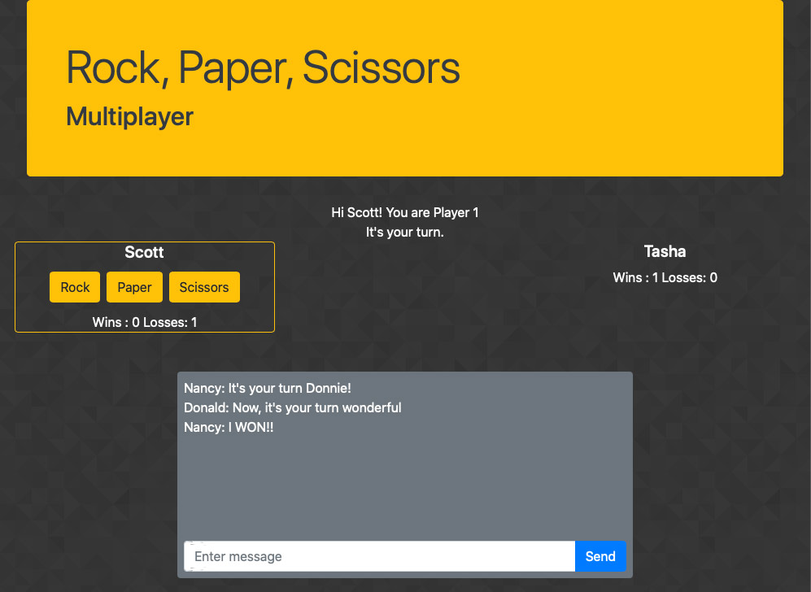

# Rock-Paper-Scissors

## Overview

Deployed at:  https://lukeevangraham.github.io/Rock-Paper-Scissors/

Rock Paper Scissors is an online multiplayer game.  After two players log in the game prompts Player 1 to select between the classic options of rock, paper and scissors.  Once Player 1 makes their selection the game prompts Player 2.  Then the game displays the Player's choices and winner.  The game tracks each player's wins and losses.  A chat area below the game exists for taunting and conversing.

## Technology

The game stores it's data in a Firebase Realtime Database.  The Multiplayer aspect of the game utilizes Firebase's Presence technology.  I used JQuery to update the game's HTML elements.  Lastly I used Bootstrap as a CSS framework.